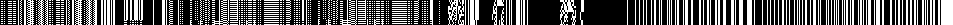
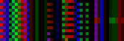
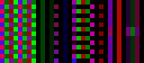
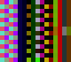

goNetViz
========

This is `goNetViz` and it is written in [golang](https://golang.org/).
`goNetViz` visualizes your network traffic, either by reading a file or
attaching to a network interface.

        $ ./main -help
          ./main [-bits ...] [-count ...] [-file ... | -interface ...] [-filter ...] [-list_interfaces] [-help] [-prefix ...] [-size ... | -timeslize ... | -terminal] [-version]

          -bits uint
                Number of bits per pixel.
                It must be divisible by three and smaller than 25 (default 24)
        -count uint
                Number of packets to process.
                If argument is 0 the limit is removed (default 25)
        -file string
                Choose a file for offline processing
        -filter string
                Set a specific filter
        -help
                Show this help
        -interface string
                Choose an interface for online processing
        -list_interfaces
                List available interfaces
        -prefix string
                Prefix of the resulting image (default "image")
        -size uint
                Number of packets per image (default 25)
        -timeslize uint
                Number of microseconds per resulting image.
                So each pixel of the height of the resulting image represents one microsecond
        -terminal
                Visualize on terminal
        -version
                Show version

Building
--------

        $ git clone git@github.com:florianl/goNetViz.git
          Cloning into 'goNetViz'...
          [...]
        $ cd goNetViz/
        $ export GOPATH=$HOME/go
        $ go get github.com/google/gopacket
          [...]
        $ go build main.go
          [...]
        $ ./main
          [...]

Or you can get it directly via [golang](https://golang.org/):

        $ export GOPATH=$HOME/go
        $ go get github.com/florianl/goNetViz
          [...]
        $ $GOPATH/bin/goNetViz
          [...]

Examples
--------

The images below are based on the very same IP traffic. The differences are
based on the number of bits per pixel. In the first image one bit is used
per pixel. Then, in the second image, 3 bits of the payload are used per pixel.
This is followed by 9 and 12 bits per pixel and finally 24 bits per pixel.

